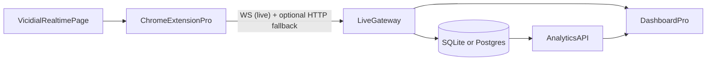

## Goal (what we optimize for)

- **Primary outcome**: trustworthy **call-flow + agent-state telemetry** that can later power shift analytics (first hour, peak hour, half shift, comparisons).
- **Approach**: build a clean **Pro** version alongside the existing project (leave current code as-is), using the saved Vicidial HTML as the contract.

## Confirmed current pipeline (existing project)

- Extension scrapes Vicidial → POST to ingestion server `:3000` → SQLite → API server `:3001` → React dashboard.

## New target architecture (Pro phases)

## Phase 0: Specs-first using HTML references

- Use `[References/Real-Time Main Report_ ALL-ACTIVE.html](References/Real-Time%20Main%20Report_%20ALL-ACTIVE.html)` as the **scraping contract**.
- Extract the stable selectors for:
  - **Agent rows**: `tr.TR`* with key columns (station, user, name, campaign, session_id, status, pause/INCALL/READY, time-in-state, calls, group).
  - **Waiting calls table**: rows `tr.csc`* and its columns (status/campaign/phone/server/dialtime/type/priority).
  - **Top meta**: dial level + dialable leads (already extracted), plus any “calls today / dropped / etc” available in the HTML.
- Produce a **scrape field list** (source column → normalized field → type) and a **state taxonomy**.

## Phase 1: Extension Pro (MV3) — reliable background collection

- New folder: `Vici-Monitor-Medalert-Pro/extension/`
- Requirements:
  - **Runs when Vicidial tab is not focused**: use event-driven + alarms; keep last snapshot in `chrome.storage`.
  - **Throttled but low-latency**: observe DOM changes + periodic sampling; avoid overwhelming page.
  - **Auth**: extension login (no signup/forgot). Token stored securely in extension storage.
  - **Modular code**: split scraping/parsing/state mapping/networking/ui into separate modules.

## Phase 2: Live pipeline first (Dashboard consumes live data)

- New folders:
  - `Vici-Monitor-Medalert-Pro/live-gateway/` (WebSocket server + auth + broadcast)
  - `Vici-Monitor-Medalert-Pro/dashboard/` (React UI consuming WS + REST)
- Keep DB out of the critical path initially: dashboard should render from **live stream**.

## Phase 3: Add persistence + analytics

- Once live telemetry is stable, persist:
  - Raw snapshots (append-only)
  - Derived rollups (5m/15m/hour) keyed by shift_date and bucket_start
- Implement shift analytics filters and peak-hour detection.

## Docs + standards (monorepo)

- Add a `docs/` area in the Pro folder:
  - **Project structure**
  - **API routes** documented in `.txt` (as requested) + optional OpenAPI later
  - **Scraping contract** (HTML selectors and field mapping)
  - **Phases / roadmap** (update `SMART_PLAN.md` into a more grounded plan once contract is confirmed)

## Key insight from current code + reference HTML

- The extension currently captures **Vicidial row color** as `row.className` (examples: `TRlightblue`, `TRpurple`, `TRviolet`, `TRthistle`, `TRblank`).
- Your legend image defines what these colors *mean operationally* (waiting/call/paused + duration buckets). In Pro we should encode this as a deterministic **state mapping function** from:
  - `row.className` (TR*)
  - plus status cells like `INCALL`, `READY`, `DISPO`, `PAUSED`
  - plus time-in-state value

## Open items to decide later (but we won’t block Phase 0)

- Exact “millisecond” goal: DOM + browser scheduling means true millisecond scraping is unrealistic; we can target **sub-second perceived freshness** (e.g., 250–1000ms sampling + change detection) and measure end-to-end latency.
- Storage choice later: keep SQLite initially; migrate if needed.

